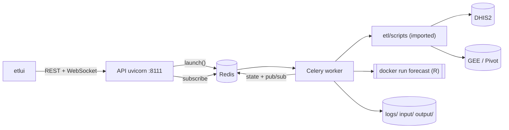

# `etlhub` architecture (Hub Center API)

> Compact version, updated on 2026-10-02 from a reading of the code. Nothing was run under real conditions: the behaviours described here are read from the code, not observed.
> Endpoint and variable tables: `.claude/skills/etlhub/references/reference.md`. Known problems: `known-issues.md`.

## 1. Role

A **FastAPI** service that exposes the PRIDE-C ETL scripts (`etl/scripts/*.py`) and the R forecast pipeline over HTTP. Long-running tasks run in **Celery** workers; state and logs live in **Redis** and in `logs/`; progress is broadcast over **WebSocket**. The front-end is `etlui` (Vue).

## 2. Runtime topology

| Process | How to start it | Note |
|---|---|---|
| API | `cd etlhub && python -m run_server` | `main.py` does `os.chdir` to the repository root |
| Worker | `python -m etlhub.run_celery` (from the root) | default prefork pool, working directory not verified |
| Redis | `redis-server` | external, `localhost:6379/0` by default |

Deployment outside a development machine is **not documented**: no etlhub Dockerfile, neither etlhub nor Redis in `compose.yaml`, and `README.md` mentions a `compose-prod.yaml` that is not in the repository.

## 3. Layers

| Layer | Content |
|---|---|
| `core/` | `config.py`, `dependencies.py` (composition root), `celery_app.py` |
| `domain/` | exceptions, `Protocol` ports, Pydantic DTOs |
| `application/use_cases/` | services (generate the `job_id`), `run_*` wrappers, stdout capture |
| `infrastructure/` | `tasks.py`, `job_store.py`, `request_tracker.py`, `config_store.py`, `forecast_runner.py` |
| `api/` | routers, WebSocket, DHIS2 auth, middleware, `etl_events.py` |

Intended direction: `api` → `application`, `core` · `application` → `domain` · `infrastructure` → `domain`, `application` · `domain` → nothing. Adapters are singletons (`@lru_cache`); services are built per request (`Depends`).

Actual deviations: `application` and `infrastructure` import `etlhub.api.etl_events` (the `EventPublisher` port is never injected); `core` has a dead import towards `api`; `api` uses `ConfigStore` and `get_request_tracker` without injection; `api` calls `etl.scripts` (`get_dhis_url`). Above all, the coupling with the rest of the repository is **circular**: `etlhub` imports `etl.scripts.*`, and `etl/scripts/config.py` imports `etlhub.infrastructure.config_store`. This relies on `sys.path` and on `os.chdir` (`main.py`).

## 4. Job lifecycle

1. `POST /<job>?webhook_url=…` → the service generates `job_id = <type>_<8 hex>` and calls `TaskLauncher.launch` → **202** response `{status, message, job_id, webhook_url}`.
2. The worker runs `_run_task`: `job:{id}` becomes `running`, the script runs with stdout/stderr captured (`_JobLogger`), each fragment is published on `etl_logs:{id}` and appended to `logs/{id}.log`.
3. End: `job:{id}` becomes `success` or `error`, a message is published on `etl_status:{id}`, and the webhook is POSTed if one was given. On error the task re-raises the exception.
4. The front opens `WS /api/tracking/etl-logs/{job_id}`: `etl_log_history` → `job_status_update` / `etl_log_entry` → `etl_log_complete` → close. Code `4004` if there is no history.

Worth knowing:
- Forecast writes its logs **only at the end**: a WebSocket opened during the run receives `4004`. For ETL jobs the same happens if it opens before the first `print`. `etlui` does not retry, because the close is clean.
- `etlui` marks a step `success` as soon as it receives the 202, without waiting for the job to finish.
- No timeout anywhere (Celery, forecast `subprocess.run`). If the worker is killed, `job:{id}` stays `running` until the TTL (24 h) expires, and the WebSocket stays open.
- `/post_forecast` and `/update_key` do not follow this model: they run **synchronously** in the API, which blocks the asyncio loop.

## 5. State and persistence

| Data | Where | Lifetime |
|---|---|---|
| Job status | Redis `job:{id}` | 24 h TTL |
| Job logs | Redis `etl_logs:{id}` + `logs/{id}.log`, `logs/{id}.json` (forecast) | 24 h TTL; files are never purged |
| HTTP requests | Redis `req:{id}` + `logs/requests/*.json` | 24 h TTL; files are never rotated (511 files at the time of the audit) |
| Dynamic config | Redis, hash `app:config:dynamic` | no TTL |
| ETL data | `input/`, `output/` | never purged |

`list_recent` reads the files in `logs/requests/` (sorted by modification time), not Redis. Scripts write under `os.getcwd()/input|output`: the repository root on the API side, and an unverified directory on the worker side. Redis has four roles: Celery broker and backend, job state, pub/sub, and dynamic configuration. The dynamic config (`DHIS_URL`, `DHIS_TOKEN`, `PARENT_OU`, `OU_LEVEL`, `DISEASE_CODE`) is read by the forecast container **and** by the ETL scripts (which also read `DRYRUN` and `LOG_LEVEL`).

## 6. External integrations

- **DHIS2**: writes (`dataValueSets`, `resourceTables`, datastore) and reads (`analytics`, `organisationUnits`). The scripts use the configuration from `etl/scripts/config.py`.
- **GEE** and **Pivot**: read by `import_gee` and `import_pivot_*` (service key `.gee-private-key.json` in the current directory).
- **Docker**: the worker runs `mvevans89/pridec_forecast:0.1.0` (`host` network, `input/` read-only, `output/` read-write); it needs access to the Docker socket.
- **Authentication**: `etlui` only uses API-token login. `POST /auth/validate-token` returns the user; the raw DHIS2 token is stored in `localStorage` and sent as `Authorization: Bearer` on every call. The back end checks it against DHIS2 (`/api/me.json`, 120 s in-memory cache) **only** on `/api/config/*` and `/auth/me`. The OAuth routes exist (`/auth/dhis2/*`) but the front end does not call them.

## 7. Data pipeline

Documented order (`README.md`): imports → `build_analytics` → `fetch_*` → `validate_inputs` → `forecast` → `post_forecast` → `build_analytics` → `calc_csb_alerts` → `update_key` → `build_analytics`. `etlui` does not automate it: one step per click. Nothing in the code enforces the order.

| Step | Reads | Writes | Depends on |
|---|---|---|---|
| `import_gee` | GEE (last 3 months) | DHIS2 `dataValueSets` | — |
| `import_pivot_com`, `import_pivot_csb` | Pivot (8 months) | DHIS2 `dataValueSets` | — |
| `build_analytics` | — | DHIS2 `resourceTables/analytics` (does not wait for completion; ignores `DRYRUN`) | the imports |
| `fetch_climate` | DHIS2 `analytics` | `input/climate_data.json` | import_gee, build_analytics |
| `fetch_disease` | DHIS2 `analytics` (`DISEASE_CODE`) | `input/disease_data.json` | import_pivot_*, build_analytics |
| `fetch_geojson` | DHIS2 `organisationUnits.geojson` | `input/orgUnit_poly.geojson` | — |
| `validate_inputs` | `input/` + user-provided `config.json` | `input/{config,input,polygon}_valid.*` | the 3 `fetch_*` |
| `forecast` | the 3 `*_valid` files | `output/` (`forecast_report.html`, `forecast.json`), `.output_sig`, `logs/{id}.json` | validate_inputs |
| `post_forecast` | `output/forecast.json` | DHIS2 `dataValueSets` | forecast |
| `calc_csb_alerts` | DHIS2 `analytics` | DHIS2 `dataValueSets` | post_forecast, build_analytics |
| `update_key` | — | DHIS2 datastore `pridec/pridec_update` | last |

Concurrency: no lock and no deduplication. Two simultaneous `fetch_*`, `validate_inputs` or `forecast` runs write the same files without protection; imports resend the same values on every run, so deduplication depends on DHIS2.

## 8. Security (summary)

1. Only `/api/config/*` and `/auth/me` are authenticated. Everything else is open, including DHIS2 writes, `docker run`, `DELETE /output/reset` and the WebSocket.
2. `/output/reset` is protected only by the existence of an `.output_sig` file, with a `sudo rm -rf` fallback.
3. `webhook_url` and `dhis2_url` (when `DHIS2_ALLOWED_HOSTS` is empty) allow outgoing requests to any address.
4. `GET /api/config/` returns `DHIS_TOKEN` in clear. The middleware logs the full URL: any secret in a query string ends up in `logs/requests/`.
5. The worker needs the Docker socket (equivalent to root on the host).

## 9. Operations

- **Start**: see section 2, plus `GETTING_STARTED.md`. The real port is 8111 (some files say 8000).
- **Test**: `cd etlhub && ../test-venv/bin/python -m pytest tests -m "not integration"`. 31 tests, Redis and GEE mocked. `etlhub/pytest.ini` is ignored (its header is `[tool:pytest]`).
- **CI**: `etlhub-unit-tests.yml` (push and PR on `etlhub/**`), `etlhub-integration-tests.yml` (PR, DHIS2 secrets).
- **Observe**: `GET /api/tracking/*`, `logs/`. There is no logging configuration in `etlhub/`.
- **Purge**: nothing is automatic (`logs/`, `logs/requests/`, `input/`, `output/`). `dump.rdb` and `logs/` are ignored by git.

## 10. Architecture decisions

Commits are a single line and give no reasons. The dates below are commit dates; **the reasons are for the team to fill in**.

| Date | Choice | Reason |
|---|---|---|
| 2026-05-22 | FastAPI + Dockerfile (`c885da6`) | to be filled in |
| 2026-06-01 | "Clean" layered architecture (`f009ccf`) | to be filled in |
| 2026-06-15 | Rename `hubcenter` → `etlhub` | to be filled in |
| 2026-06-18 | Celery for background tasks (`928b799`) | to be filled in |
| 2026-06-29 | Statuses published on Redis (`8b9e33e`) | to be filled in |
| 2026-07-10 | `output/` reset by signature (`e333ca0`) | to be filled in |
| 2026-07-21 | Dynamic config in Redis (`75e18ef`) | to be filled in |